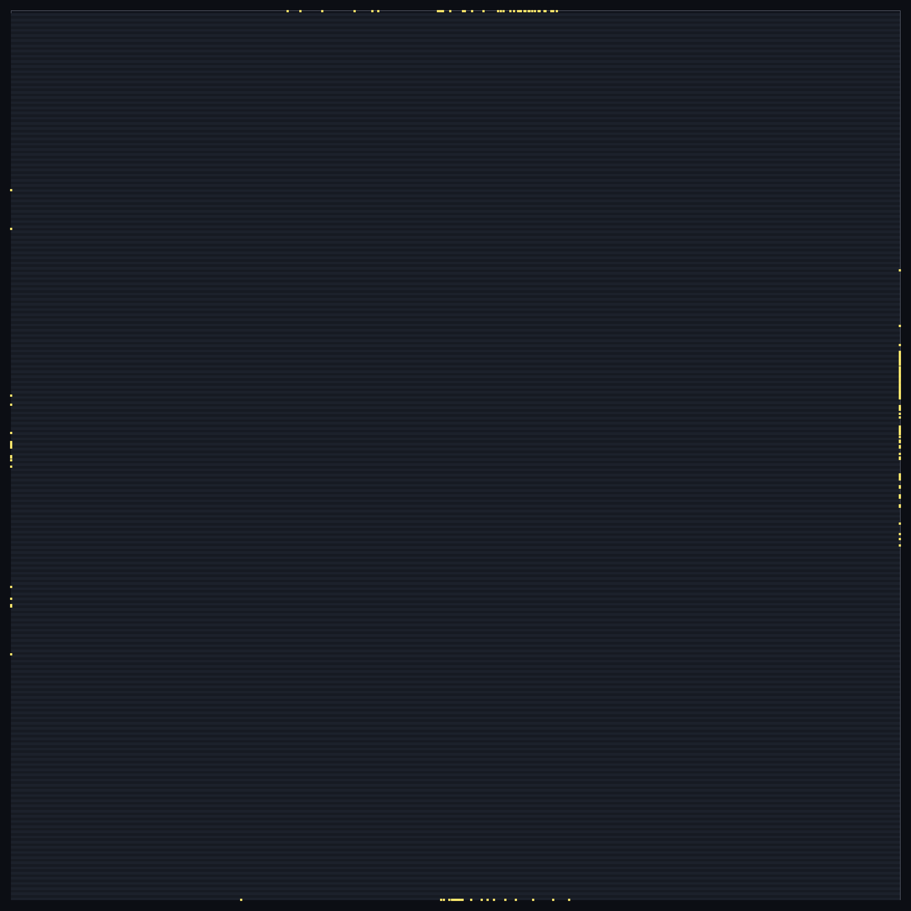
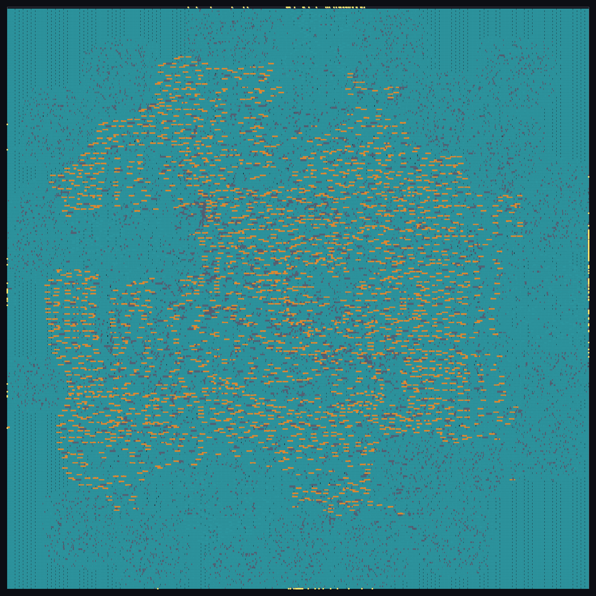
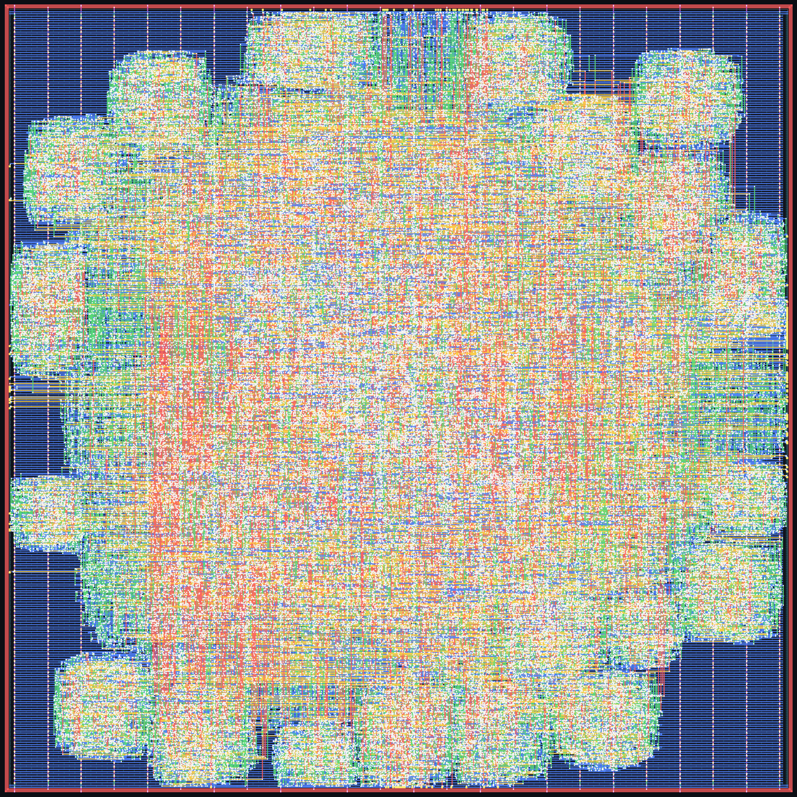
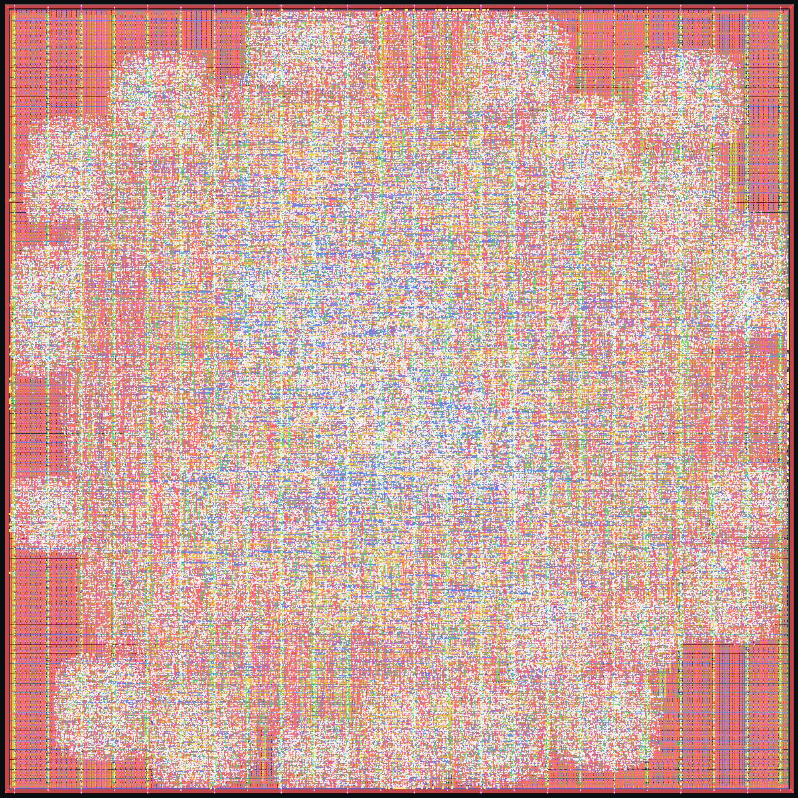

# AES-128 encryption / decryption engine — RTL to GDSII on SKY130 with IndepthSilicon

**`crypto_aes` taken from RTL to a signed-off GDSII layout by the IndepthSilicon flow, in one run, at a 15 ns clock (66.7 MHz) on SkyWater SKY130 (`sky130_fd_sc_hd`). Every sign-off number below was re-measured on the shipped layout by independent, widely used open-source sign-off tools, and every one of them is at zero.**

An AES-128 (FIPS 197) encrypt and decrypt engine with an AXI4-Lite register interface: iterative datapath, one round per cycle, 10-cycle latency, ECB block mode.

## Result at a glance

| Check (on the shipped layout) | IndepthSilicon | Independent tool |
|---|---:|---:|
| Design-rule check | **0** violations | **0** — SKY130 foundry rule deck |
| Layout vs schematic | **match** (34,179 / 34,179 nets) | **match** — 34,420 devices |
| Antenna | **0** | **0** nets, **0** pins |
| Setup timing, 3 corners | **met** (worst 0.282 ns) | **met** (worst 0.297 ns) |
| Hold timing, 3 corners | **met** (worst 0.077 ns) | **met** (worst 0.074 ns) |
| Max slew / capacitance / fanout | **0 / 0 / 0** | **0 / 0 / 0** |
| Shipped netlist equal to RTL | **proven** (2,227 / 2,227 compare points) | **proven** (6,489 compare points) |

## Layout

| | |
|---|---|
|  |  |
| **Floorplan** — die, standard-cell rows, I/O pins | **Placement** — placed cells after clock-tree build |
|  |  |
| **Routing** — 5 metal layers, before fill | **Final layout** — the shipped GDSII, filler cells and metal fill included |

## Stage-by-stage comparison

Three columns, for the same RTL and the same 15 ns clock:

* **IndepthSilicon** — what the IndepthSilicon flow reports about its own result.
* **Independent tool** — the IndepthSilicon layout and netlist re-measured by an independent open-source sign-off tool (which tool is listed under *How the independent numbers were produced*).
* **Reference flow** — the same RTL taken through the open-source LibreLane 3.0.1 flow (OpenROAD-based), default configuration, same PDK and clock. It is a separate implementation of the same design, shown for scale.

| Stage | Metric | IndepthSilicon | Independent tool | Reference flow |
|---|---|---:|---:|---:|
| RTL read-in | gates / registers after elaboration | 58,901 / 2,185 | — | — |
| Synthesis | mapped cells | 25,002 | — | 21,120 |
| Synthesis | cell area (µm²) | 293,877 | — | 245,505 |
| Synthesis | registers | 2,185 | — | 2,149 |
| Synthesis check | netlist equal to RTL (compare points) | 2,227 / 2,227 proven | — | not checked |
| Test insertion | scan chains / registers on chain | 22 / 2,185 | — | not inserted |
| Test insertion | stuck-at fault coverage (test coverage) | 99.43 % (99.90 %), 2,076 patterns | — | — |
| Floorplan | die size (µm) | 947.5 × 947.5 | — | 794.5 × 805.2 |
| Floorplan | die area (µm²) | 897,756 | — | 639,699 |
| Clock tree | clock buffers | 291 | — | 355 |
| Routing | signal nets routed | 34,175 | — | 28,383 |
| Routing | routed signal wirelength (µm) ¹ | 2,172,934 | — | 1,786,298 |
| Routing | vias ¹ | 285,732 | — | 340,760 |
| Routing | antenna diodes inserted | 336 | — | 34,876 |
| Final netlist | logic cells (no fill, tap or diode) | 33,753 | — | 28,458 |
| Physical verification | DRC violations | **0** | **0** (foundry deck) | 0 |
| Physical verification | LVS | **match** | **match** (34,420 = 34,420 devices) | 0 errors |
| Physical verification | antenna violations | **0** | **0** nets / **0** pins | 0 |
| Physical verification | netlist ↔ layout connections missing / extra | — | **0 / 0** | — |
| Physical verification | undriven / multiply-driven nets | — | **0 / 0** | — |
| Timing — typical, 25 °C, 1.80 V | setup worst slack (ns) ² | **2.377** | **2.346** | 2.717 |
| Timing — slow, 100 °C, 1.60 V | setup worst slack (ns) ² | **0.282** | **0.297** | -7.957 |
| Timing — fast, −40 °C, 1.95 V | setup worst slack (ns) ² | **3.024** | **3.004** | 7.021 |
| Timing — typical, 25 °C, 1.80 V | hold worst slack (ns) | **0.269** | **0.265** | 0.321 |
| Timing — slow, 100 °C, 1.60 V | hold worst slack (ns) | **0.294** | **0.292** | 0.671 |
| Timing — fast, −40 °C, 1.95 V | hold worst slack (ns) | **0.077** | **0.074** | 0.112 |
| Timing | max slew / capacitance / fanout violations | **0 / 0 / 0** | **0 / 0 / 0** | 35,643 / 307 / 3,184 |
| Timing | clock-gate enable paths: gates / unconstrained / worst setup (ns) | — | 6 / 0 / 0.51 | — |
| Power | total, typical corner (mW) ³ | 24.262 | 24.494 | 181.412 |
| Power | worst IR drop VPWR / VGND (mV) ³ | 0.483 / 0.490 | 0.474 / 0.485 | 1.310 |
| Sign-off | shipped netlist equal to RTL | **proven** 2,227 / 2,227 | **proven** — 2,149 registers paired, 6,489 compare points | not checked |

¹ Measured from each flow's DEF the same way (signal nets only, power and ground excluded); the same script reproduces the reference flow's own reported wirelength to within 1 µm.

² IndepthSilicon's column is reported with level-sensitive latch pins timed at their opening edge, the convention the independent timer uses, so the two columns are directly comparable. The reference flow is at its nominal parasitic corner; across all of its nine corners its worst setup slack is -9.220 ns and its worst hold slack 0.110 ns.

³ IndepthSilicon and the independent tool use the same deterministic activity (every data net 0.1 transitions per cycle, clock 2) and agree within a few percent. The reference flow's power uses its own activity setting and its IR drop is on its own power grid at its own power, so that column is shown for scale only, not as a like-for-like comparison.

### Reading the comparison

* **Synthesis.** IndepthSilicon maps this design to 18 % more cells than the reference flow (20 % more cell area).
* **Routing.** It routes 22 % more signal wire over 20 % more nets. Part of the difference is the 22 scan chains IndepthSilicon inserts for manufacturing test, which the reference flow does not; the dies also differ in size.
* **Timing.** At 15 ns the reference flow does not close timing (worst setup slack -9.220 ns across its corners) and leaves 35,643 slew, 307 capacitance and 3,184 fanout violations. IndepthSilicon meets setup and hold at all three corners with zero slew, capacitance and fanout violations, and the independent timer agrees.
* **Verification.** IndepthSilicon proves its shipped netlist equal to the RTL inside the flow, and an independent equivalence checker proves the same; the reference flow runs no equivalence check.

## How the independent numbers were produced

None of these tools is part of IndepthSilicon. Each one reads the shipped files (GDSII, DEF, Verilog netlist) directly.

| Check | Independent tool |
|---|---|
| Design rules | KLayout with the SKY130 foundry rule deck (`sky130A_mr.drc`) on the GDSII |
| Parasitics + static timing, 3 corners | OpenRCX extraction from the DEF, OpenSTA with the SKY130 Liberty corners |
| Antenna | OpenROAD antenna checker on the DEF |
| Layout vs schematic | Magic extraction + Netgen comparison, as the reference flow runs them |
| Power, IR drop | OpenSTA power report; OpenROAD PDNSim on the drawn power grid |
| Equivalence, shipped netlist vs RTL | Yosys elaborates the RTL on its own; ABC proves the two equal |

The independent tools' own reports are in [`reports/independent/`](reports/independent/).

## Repository layout

```
crypto-aes-gds2-flow/
├── rtl/crypto_aes.v                 design RTL
├── flow/run_flow.txt              the complete flow script (one run, RTL to GDSII)
├── netlist/crypto_aes_postpnr.v     shipped gate-level netlist
├── layout/crypto_aes.gds.gz         shipped GDSII (gzip)
├── layout/crypto_aes.def.gz         shipped DEF (gzip)
├── images/                        floorplan, placement, routing, final layout
└── reports/independent/           timing, DRC, LVS, antenna, power, equivalence reports
```

## The flow

One script, one run. The flow chooses the die from the cell area, places, builds the clock tree, routes, closes timing and sign-off, and writes the layout:

```
load_sky130
read_verilog rtl/crypto_aes.v
set_clock_period 15
run_all 200 200
write_netlist crypto_aes_postpnr.v
write_def crypto_aes.def
write_gds crypto_aes.gds
write_image images/04_final_layout.png routing
exit
```

Stages, in order: RTL read-in and lint, logic synthesis and technology mapping to `sky130_fd_sc_hd`, equivalence check of the netlist against the RTL, scan insertion and test-pattern generation, floorplan and power grid, placement, clock-tree build, routing, timing and electrical repair, filler and metal fill, then physical verification (DRC, LVS, antenna), multi-corner timing sign-off on extracted parasitics, power and IR drop, and a final equivalence check of the shipped netlist against the RTL.

---

*Layout, netlist and reports produced by the IndepthSilicon flow. SKY130 is an open PDK. Clock 15 ns at every corner.*
